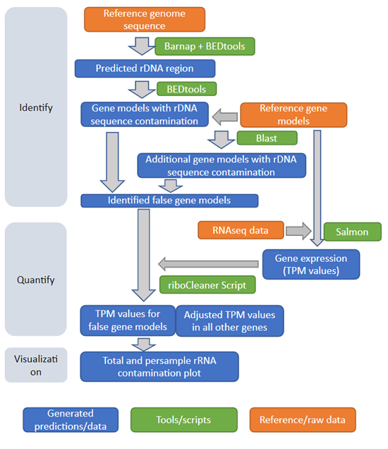

# riboCleaner

riboCleaner is an open-source workflow designed to identify and quantify rRNA abundance in RNA-Seq data. riboCleaner has two main workflows: identify and quantify.

The identify workflow *identifies* putative rDNA genes in a genome of interest. First, it uses [barrnap](https://github.com/tseemann/barrnap) to identify coordinates that contain rDNA elements in a genome (fasta) and then bundles these elements into non-overlapping operons. Then it compares these regions to the predicted genes (gff) to identify genes that were predicted in overlapping coordinate space as a predicted rDNA operon. These genes are flagged as putative rDNA contaminants. Then, the rest of the genes are compared to the rDNA contaminant gene list using *blastn* and any that pass a sequence identity and coverage threshold are also flagged as rDNA.

The quantify workflow *quantifies* the abundance of rRNA transcripts in RNA-Seq samples. For this we use [salmon](https://combine-lab.github.io/salmon/) to quantify the abundance of transcripts in each sample (including the putative rDNA gene models). This allows any reads derived from rRNA to map to the rRNA transcripts and avoids biasing the counts of mRNA transcripts with homologous rRNA reads. Then, riboCleaner quantifies the abundance of the rRNA transcripts to give an estimate of rRNA prevalence in the RNA-seq data and visualizes the results. As a final step, riboCleaner removes the rRNA transcripts from the salmon counts table to yield a table of mRNA abundances that can be normalized and used for downstream analysis.

This [workflow diagram](./riboCleaner_figure_S1.png) shows how the different parts of the riboCleaner standard workflow fits together. You can also read a [more detailed description of the methods](./detailed_methods.md) or see the [Snakemake DAG](./riboCleaner.png). 




---

## Quick Start

If you want to see the output riboCleaner produces, we have provided the [report from running riboCleaner on a test dataset](test_data.example_report.zip)

To jump right in and run riboCleaner as fast as possible:


```bash
# clone this repo
git clone https://github.com/basf/riboCleaner.git
cd riboCleaner/test_data
```

Then follow the [instructions in the test data README](./test_data/README.md) to make sure everything is set up properly.

Once the workflow runs on the test data, replace the test data inputs with your own (and delete the contents of the `results` directory) and rerun. 


---

## Getting riboCleaner

riboCleaner is a containerized application which means you won't need to download and install any tools other than a container management platform (Docker or Singularity) in order to run the riboCleaner workflow.

Our workflow was developed and tested most thoroughly using Docker, but it can also be ran as a Singularity container. Singularity is a good option when you have access to shared compute resources (such as a High Performance Computing Cluster) where you do not have administrator access. This requires having the Singularity command available, which does require administrator access.

Specific steps for pulling the riboCleaner container using Docker or Singularity are given below.


## Preparing your files

To make riboCleaner easier to run, we recommend the following directory structure:

```
.
├── inputs/			-> all the inputs for riboCleaner are stored here
│   ├── config.yaml		-> configuration parameters for the riboCleaner workflow (see below)
│   ├── raw_data/		-> your input FASTQ files go here (FASTQ input optional)
│   │   ├── sample1.R1.fq.gz
│   │   ├── sample1.R2.fq.gz
│   │   ├── sample2.R1.fq.gz
│   │   └── sample2.R2.fq.gz
│   ├── references/		-> your reference genome's genomic FASTA and GFF file
│   │   ├── reference.fna
│   │   └── reference.gff
│   └── sample_data.tsv		-> maps your sample names to your FASTQ input (FASTQ input optional)
├── results/			-> results from riboCleaner will be written to this directory
└── .snakemake/			-> Snakemake will track it's progress here as it runs the riboCleaner workflow

```

See the [test_data](./test_data) for an example of how this structure might look on real data. One good way to set up this directory structure is to clone riboCleaner and simply replace the test data with your own.

```bash
git clone https://github.com/basf/riboCleaner.git
```

Alternatively, you can set up the directory structure (along with placeholder files) with the following commands:

```bash
# set up directories
mkdir -p inputs/raw_data inputs/references .snakemake results

# optionally set up placeholder files
#touch inputs/config.yaml inputs/sample_data.tsv inputs/references/reference.fna inputs/references/reference.gff inputs/raw_data/sample1.R1.fq.gz inputs/raw_data/sample1.R2.fq.gz inputs/raw_data/sample2.R1.fq.gz inputs/raw_data/sample2.R2.fq.gz
```

### inputs/references (directory)

You will have to obtain a genomic FASTA as well as a GFF file for your organism of interest and place it here. Make sure the names match between the two files because genes will be extracted from the FASTA using the GFF file as an early step in rDNA identification.

In `config.yaml`, add the paths to the reference files and make sure the GFF feature corresponding to your gene/mRNA elements is correct (often for eukaryotes, this is "mRNA", for bacteria, it might be "gene" or "CDS"). *When specifying paths, make them relative to this directory because that is where the analysis will be ran from.* Once again, the test dataset is a good reference for how the paths should look.


### inputs/config.yaml (file)

The `config.yaml` file is one of the most important files from the workflow because it specifies the parameters that will be used. 

It is a good idea to use the [test data config file](./test_data/inputs/config.yaml) as a starting point and update the fields to match your data. *When specifying paths, make them relative to this directory because that is where the analysis will be ran from*.

Make sure to update:

- reference genome
- reference gff
- kingdom (if needed)
- gff_feature (if needed)

We have found that using 10000 subsampled reads is sufficient to get an estimate of rDNA contamination in our data. 


### inputs/sample_data.tsv (file)

If you are quantifying rDNA in RNASeq samples, you will need a sample data file to let riboCleaner know which data corresponds to which samples. 

An [example of a sample data file](./test_data/inputs/sample_data.tsv) can be found in the test data. Essentially, this is just a tab-delimited file with sample names and read files. You will have to make this file to correspond with your own input data. *When specifying paths, make them relative to this directory because that is where the analysis will be ran from*

We made the sample file for the test data by running the following command. You may find a similar one works for your data when ran from your `inputs` directory.

```bash 
# from ./test_data/inputs
echo -e "sample-id\tr1\tr2" > sample_data.tsv && \
    for r1 in raw_data/*R1*.gz; do r2=${r1/.R1./.R2.}; name=`basename ${r1/.R1*/}`; echo -e "$name\t$r1\t$r2"; done >> sample_data.tsv
```

---

## Running riboCleaner

Once all your files are set up in `inputs` and you have created `results` and `.snakemake` directories to store files created while riboCleaner runs, you are ready to run the workflow.

We include instructions for running riboCleaner with Docker or with Singularity.

### Using Docker

After running the following command, the riboCleaner Docker image will be added to your image registry and be ready to run. 

```bash
docker pull basfcontainers/ribocleaner
```

Alternatively, you can clone this repository and build the Docker containers manually:

> While we want to include the ability to do this, we recommend pulling the image because it is easier and there is a chance of new versions (incompatible?) of software being pulled into new builds. We will always test the official release to make sure it is working as expected. 

```bash
# clone the repo
git clone https://github.com/basf/riboCleaner.git
cd riboCleaner

# build the core container
make build
```

Once you have the riboCleaner Docker container, the workflow can be ran as follows:

```bash
# printing what commands will be ran
# the -n option in snakemake is useful to check what will be ran without actually running anything
docker run \
    -v ${PWD}/inputs:/analysis/inputs \
    -v ${PWD}/results:/analysis/results \
    -v ${PWD}/.snakemake:/analysis/.snakemake \
    basfcontainers/ribocleaner \
    snakemake --cores 1 -npr all

# running the full workflow (on 8 cores)
docker run \
    -v ${PWD}/inputs:/analysis/inputs \
    -v ${PWD}/results:/analysis/results \
    -v ${PWD}/.snakemake:/analysis/.snakemake \
    basfcontainers/ribocleaner \
    snakemake --cores 8 -pr all

# generating a report
# to generate this report, Snakemake requires web access
# you may need to pass proxy variables if you are on a restricted network
#-e http_proxy=${http_proxy} -e https_proxy=${https_proxy} \
docker run \
    -v ${PWD}/inputs:/analysis/inputs \
    -v ${PWD}/results:/analysis/results \
    -v ${PWD}/.snakemake:/analysis/.snakemake \
    basfcontainers/ribocleaner \
    snakemake --cores 1 --report results/riboCleaner_full_report.zip -pr all

```

---

### Using Singularity

> NOTE: Singularity can be configured with different parameters for mounting paths into the container. You may have to work with your system administrator to get this Singularity container to work properly.

After running the following command, you will have a `ribocleaner_latest.sif` file in your working directory.

```bash
# pull the container - this only needs to be done once
singularity pull docker://basfcontainers/ribocleaner

```

All singularity commands mount the `inputs`, `results`, and `.snakemake` directories to give the container access to required data and then run variations of the snakemake command in the `/analysis` directory within the container.

```bash

# dryrun
singularity exec \
    -e \
    -B ${PWD}/inputs:/analysis/inputs \
    -B ${PWD}/results:/analysis/results \
    -B ${PWD}/.snakemake:/analysis/.snakemake \
    ribocleaner_latest.sif \
    bash -c "cd /analysis && snakemake --cores 1 -npr all"

# run full workflow
singularity exec \
    -e \
    -B ${PWD}/inputs:/analysis/inputs \
    -B ${PWD}/results:/analysis/results \
    -B ${PWD}/.snakemake:/analysis/.snakemake \
    ribocleaner_latest.sif \
    bash -c "cd /analysis && snakemake --cores 8 -pr all"

# make the report
singularity exec \
    -e \
    -B ${PWD}/inputs:/analysis/inputs \
    -B ${PWD}/results:/analysis/results \
    -B ${PWD}/.snakemake:/analysis/.snakemake \
    ribocleaner_latest.sif \
    bash -c "cd /analysis && snakemake --cores 1 --report results/riboCleaner_full_report.zip -pr all"

```

---

### Running in the Cloud

If you do not have access to a Linux-based workstation or compute cluster, cloud computing can be an effective alternative. 

We have tested riboCleaner using a *Standard D8s v3 (8 vcpus, 32 GiB memory)* Azure VM running *Linux (ubuntu 18.04)*

#### Installing Docker

Installation [instructions for Ubuntu](https://docs.docker.com/engine/install/ubuntu/)

```bash
sudo apt-get update

sudo apt-get install -y \
    apt-transport-https \
    ca-certificates \
    curl \
    gnupg-agent \
    software-properties-common

curl -fsSL https://download.docker.com/linux/ubuntu/gpg | sudo apt-key add -

sudo apt-key fingerprint 0EBFCD88

sudo add-apt-repository \
   "deb [arch=amd64] https://download.docker.com/linux/ubuntu \
   $(lsb_release -cs) \
   stable"

sudo apt-get update

sudo apt-get install -y docker-ce docker-ce-cli containerd.io

```

You can test your Docker installation by running the command `sudo docker run hello-world`

You can also add your user account to the *docker* group to allow you to run Docker containers without using `sudo`. This is an optional step, but the rest of our instructions assume a user that can run Docker without `sudo`.

```bash
sudo groupadd -f docker
sudo usermod -aG docker $USER

# now you will need to log out and then log back in to refresh group permissions
```

Once Docker is installed, you can follow the steps above for [setting up the data](#preparing-your-files) and running riboCleaner [using Docker](#using-docker).


## Running riboCleaner in identify mode

If you do not have RNA sequencing samples or just want to know which genes might be rDNA, you can run riboCleaner in **identify** mode. 

This mode will identify and output rDNA genes names and FASTA sequences (part of the outputs of running the full workflow).

Everything is the same between running in the two modes except for the Snakemake command that needs to be ran. Instead of running the *all* rule to run the full workflow, simply run the *identify* rule. An example of doing so in Docker is shown below.

```bash
# running the identify workflow (on 8 cores)
docker run \
    -v ${PWD}/inputs:/analysis/inputs \
    -v ${PWD}/results:/analysis/results \
    -v ${PWD}/.snakemake:/analysis/.snakemake \
    basfcontainers/ribocleaner \
    snakemake --cores 8 -pr identify

# generating a report
# to generate this report, Snakemake requires web access
# you may need to pass proxy variables if you are on a restricted network
# -e http_proxy=${http_proxy} -e https_proxy=${https_proxy} \
docker run \
    -v ${PWD}/inputs:/analysis/inputs \
    -v ${PWD}/results:/analysis/results \
    -v ${PWD}/.snakemake:/analysis/.snakemake \
    basfcontainers/ribocleaner \
    snakemake --cores 1 --report results/riboCleaner_identify.zip -pr identify

```

